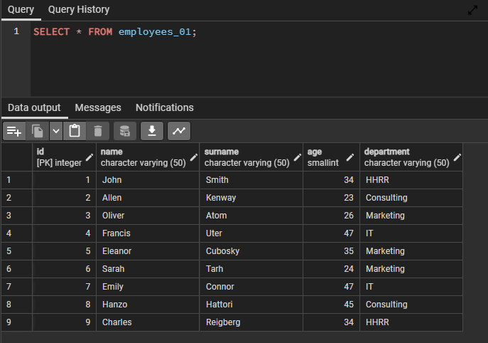

<div align='center'>
    <h1>SQL Injection Prevention (PostgreSQL)<h1>
</div>

This repository was mainly made as an investigation and trial about SQL Injection attacks. SQL Injection is one of the attacks that can deal a several impact over a database when using queries as inputs. Therefore, in PostgreSQL there is a ```PREPARE footable ([columns]) AS mode```.

If we take a look at the [official documentation](https://www.postgresql.org/docs/current/sql-prepare.html), we can see that a plan can be set for a certain table when we execute ```SELECT``` , ```INSERT```, ```UPDATE```, ```DELETE``` or ```VALUES``` statement.

Normally, Databases already have protection against SQL Injection attacks, however, being able to set up one to avoid getting attacked was something I was really attracted to. My final approach, after some changes, was to set up the ```PREPARE``` statement for every record entering the function:

```Python
prepared = False

prep_query = """PREPARE employees_01_prepared (varchar,varchar,smallint,varchar) AS
INSERT INTO employees_01 (name, surname, age, department) VALUES (%s,%s,%s,%s);"""
query = """EXECUTE employees_01_prepared (%s,%s,%s,%s);"""

if prepared == False:
    cur.execute(prep_query,employee_data)
    prepared = True
else:
    raise Exception

if prepared == True:
    cur.execute(query,employee_data)
else:
    raise Exception
```

This would be executed whenever a new data tuple enters to the function. It's true that those if statements are not really needed if we wanted to shorten the code, but for me, they add an extra layer of security in case something goes wrong. The it's a matter of executing the statement with ```conn.commit()``` and all the records will be uploaded to out PostgreSQL table as a prepared statement.



### Conclusion

As a Junior Data Engineer, I also care a lot about data security, as we may never forget that we are treating with sensitive information, and data leaks can happen, but we must be sure that we payed attention to this kind of attacks and set a tough defense against them.